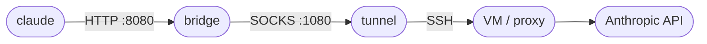

# Claude via VM Proxy Guide

A minimal, copy-paste guide to connecting Anthropic's `claude` CLI through an SSH tunnel to a remote VM / proxy.

**How traffic flows once everything is running:**



### ⚠️ Prerequisites
* **Install Node.js:** [nodejs.org](https://nodejs.org/) (This installs `npm` and `npx` automatically).

> **Two ways to connect:**
> - 🐣 **New here?** Follow the **Quick Start** below: open a couple of windows, copy-paste, done.
> - ⚡ **Tired of opening 3 windows every time?** Jump to **[One-Command Setup](#one-command-setup)** for a single `cc` command that starts the tunnel, the bridge, and Claude for you.

---

## 🔑 Quick Start (Windows)

Replace `YOUR_SERVER_IP` with the actual server IP, `YOUR_USERNAME` with your Windows username, and `YOUR_KEY_FILENAME` with your SSH key filename. You need **3 PowerShell windows** open.

---

**⚠️ First Time Setup - Fix Key Permissions (Run as Administrator):**
```powershell
$keyPath = "C:\Users\YOUR_USERNAME\.ssh\YOUR_KEY_FILENAME"

icacls $keyPath /inheritance:r
icacls $keyPath /grant:r "$($env:USERNAME):R"
icacls $keyPath /remove "SYSTEM"
icacls $keyPath /remove "Administrators"
```

**Window 1 - SSH Tunnel (keep open):**
```powershell
ssh -i C:\Users\YOUR_USERNAME\.ssh\YOUR_KEY_FILENAME -D 1080 -N -C YOUR_USERNAME@YOUR_SERVER_IP
```

**Window 2 - Bridge (keep open):**
```powershell
npx http-proxy-to-socks -p 8080 -s 127.0.0.1:1080
```

**Window 3 - Run Claude:**
```powershell
$env:http_proxy="http://127.0.0.1:8080"
$env:HTTP_PROXY="http://127.0.0.1:8080"
$env:https_proxy="http://127.0.0.1:8080"
$env:HTTPS_PROXY="http://127.0.0.1:8080"

# Verify connectivity (Optional)
curl.exe ipinfo.io

# Launch (skip permission prompts)
claude --dangerously-skip-permissions
```

<details>
<summary>📸 Screenshots — click to expand</summary>

**Step 1 — SSH Tunnel**


**Step 2 — Bridge**


**Step 3 — Run Claude**


</details>

---

## ⚡ Quick Start (Mac / Linux)

Open **three terminals** and run one command in each:

**① Tunnel** — opens a SOCKS proxy on `:1080`
```bash
ssh -i ~/.ssh/your_ssh_key -D 1080 -N -C username@gcloud_vm_ip
```

**② Bridge** — converts HTTP `:8080` → SOCKS `:1080`
```bash
npx http-proxy-to-socks -p 8080 -s 127.0.0.1:1080
```

**③ Claude** — sets proxy env vars and launches
```bash
export HTTPS_PROXY=http://127.0.0.1:8080
export NO_PROXY="172.16.199.0/24,172.16.209.0/24,localhost,127.0.0.1"
claude
```

> First time? Run `npm install -g @anthropic-ai/claude-code` once before step ③. Windows users: see the [PowerShell section](#-windows-users-powershell) below.

---

##  Mac / Linux Users

### 1. The Tunnel (Keep Terminal Open)
Run this to create a local SOCKS proxy at port `1080` that tunnels through your VM.
```bash
# -D 1080: Listen locally on port 1080
# -N: Do not execute remote commands (just forward ports)
# -C: Compress data for speed
ssh -i ~/.ssh/your_ssh_key -D 1080 -N -C username@gcloud_vm_ip
````

### 2\. The Bridge (Keep Terminal Open)

Run this to convert the SOCKS proxy (`1080`) to an HTTP proxy (`8080`) so `npm` and `claude` can use it.

```bash
npx http-proxy-to-socks -p 8080 -s 127.0.0.1:1080
```

### 3\. Install & Run

Run these commands in a **new** terminal window.

**Step A: Configure NPM & Install**

```bash
# Install Claude Code globally
npm install -g @anthropic-ai/claude-code
```

**Step B: Run Claude**

```bash
# Set environment variables for this session ONLY
export http_proxy=http://127.0.0.1:8080
export HTTP_PROXY=http://127.0.0.1:8080
export https_proxy=http://127.0.0.1:8080
export HTTPS_PROXY=http://127.0.0.1:8080
export NO_PROXY="172.16.199.0/24,172.16.209.0/24,localhost,127.0.0.1"

# Verify connectivity (Optional but recommended)
curl ipinfo.io

# Launch (skip permission prompts)
claude --dangerously-skip-permissions
```

### 4\. (Optional) Open Chrome Through the Proxy — Mac

Launches a separate Chrome instance routed through the local HTTP proxy, using a dedicated profile so it doesn't interfere with your normal browsing session.

```bash
open -n -a "Google Chrome" --args \
  --proxy-server="http://127.0.0.1:8080" \
  --user-data-dir="$HOME/Library/Application Support/Google/Chrome/Profile 4" \
  --profile-directory="Default"
```

-----

## ⊞ Windows Users (PowerShell)

### 1\. The Tunnel (Keep PowerShell Open)

Run this to create a local SOCKS proxy at port `1080`.

```powershell
ssh -i C:\path\to\key -D 1080 -N -C username@gcloud_vm_ip
```

### 2\. The Bridge (Keep PowerShell Open)

Run this to convert the SOCKS proxy (`1080`) to an HTTP proxy (`8080`).

```powershell
npx http-proxy-to-socks -p 8080 -s 127.0.0.1:1080
```

### 3\. Install & Run

Run these commands in a **new** PowerShell window.

**Step A: Configure NPM & Install**

```powershell
# Install Claude Code globally
npm install -g @anthropic-ai/claude-code
```

**Step B: Run Claude**

```powershell
# Set environment variables for this session ONLY
$env:http_proxy="http://127.0.0.1:8080"
$env:HTTP_PROXY="http://127.0.0.1:8080"
$env:https_proxy="http://127.0.0.1:8080"
$env:HTTPS_PROXY="http://127.0.0.1:8080"

# Verify connectivity (Optional but recommended)
curl.exe ipinfo.io

# Launch (skip permission prompts)
claude --dangerously-skip-permissions
```

### 4\. (Optional) Open Chrome Through the Proxy — Windows

Launches a separate Chrome instance routed through the SSH tunnel (SOCKS5 on `127.0.0.1:1080`), using a dedicated profile so it doesn't touch your normal browsing session. Only the **tunnel** needs to be running for this — the HTTP bridge isn't required for the browser.

**Option A — Edit a shortcut (easiest):**

1. Copy an existing Chrome shortcut (or right-click the desktop → **New → Shortcut**).
2. Right-click it → **Properties**, and set the **Target** to:

```
"C:\Program Files\Google\Chrome\Application\chrome.exe" --proxy-server="socks5://127.0.0.1:1080" --user-data-dir="C:\ChromeVPNProfile" --no-first-run
```

3. Rename it something like **Chrome (VPN)** and launch it whenever the tunnel is up.

**Option B — One-liner from PowerShell:**

```powershell
& "C:\Program Files\Google\Chrome\Application\chrome.exe" --proxy-server="socks5://127.0.0.1:1080" --user-data-dir="C:\ChromeVPNProfile" --no-first-run
```

> - If Chrome is installed elsewhere, the path may be `C:\Program Files (x86)\Google\Chrome\Application\chrome.exe`.
> - `--user-data-dir` keeps this profile (logins, cookies, history) isolated from your normal Chrome.
> - To also route **DNS** through the tunnel (avoid DNS leaks), append `--host-resolver-rules="MAP * ~NOTFOUND , EXCLUDE 127.0.0.1"`.

---

## ⚡ One-Command Setup (Profile Automation) :id=one-command-setup

The Quick Start above works, but opening three windows every time gets old. Instead, drop a
**shell profile** in place once and then just type **`cc`**. One command:

1. Starts the **SSH tunnel** in the background (SOCKS5 on `127.0.0.1:1080`)
2. Starts the **HTTP-to-SOCKS bridge** in the background (HTTP on `127.0.0.1:8080`)
3. Sets the `HTTP(S)_PROXY` / `NO_PROXY` environment variables
4. Verifies your external IP, then launches **Claude**

It's smart about repeats: if the tunnel or bridge is already running it reuses it instead of
starting a duplicate. `cc-stop` tears everything back down.

| Command | What it does |
|---------|--------------|
| `cc` | One-shot: tunnel + bridge + env vars + launch Claude (`--dangerously-skip-permissions`) |
| `cc-safe` | Same, but launches plain `claude` (keeps permission prompts) |
| `cc-stop` | Stop tunnel + bridge and clear the proxy env vars |
| `proxy-status` | Show what's running and your current external IP |
| `tunnel-start` / `tunnel-stop` | Manage just the SSH tunnel |
| `bridge-start` / `bridge-stop` | Manage just the HTTP bridge |
| `proxy-on` / `proxy-off` | Set / clear the proxy env vars only |

---

### 🪟 Windows PowerShell

Your profile lives at `$PROFILE` — usually
`C:\Users\<your-username>\Documents\WindowsPowerShell\Microsoft.PowerShell_profile.ps1`.

**Setup (run once):**

```powershell
# 1. Allow your own scripts to run (per-user, safe)
Set-ExecutionPolicy -ExecutionPolicy RemoteSigned -Scope CurrentUser

# 2. Download the profile straight into $PROFILE
if (-not (Test-Path $PROFILE)) { New-Item -ItemType File -Path $PROFILE -Force }
Invoke-WebRequest -UseBasicParsing -Uri "https://raw.githubusercontent.com/crayonluffy/claude-guide/main/scripts/Microsoft.PowerShell_profile.ps1" -OutFile $PROFILE

# 3. Unblock it (only needed if Windows flagged the file as web content)
Unblock-File -Path $PROFILE

# 4. Open it and edit the Settings block (SSH key path, user, host)
notepad $PROFILE     # or:  code $PROFILE

# 5. Reload the profile into the current window
. $PROFILE
```

Step 4 opens the profile so you can **edit the `Settings` block** at the top — your SSH key path,
user, and host. Save, then run step 5 to reload.

> **⚠️ Encoding gotcha (Traditional Chinese Windows):** Notepad on a zh-TW system often saves as
> **Big5 / CP950**, which corrupts the script and produces parse errors. To avoid this:
> - Edit the profile in **VS Code** or **Notepad++** and explicitly save as **UTF-8**, or
> - Write it from PowerShell with UTF-8: `Get-Content .\profile.ps1 | Set-Content -Path $PROFILE -Encoding UTF8`, or
> - Keep the profile **ASCII-only** (the published script already is) so any editor is safe.

> **First connection:** SSH will prompt `Are you sure you want to continue connecting (yes/no)?`
> the first time. The background tunnel can't answer that prompt, so run
> `ssh <your-ssh-user>@<your-gcp-hostname>` **once** interactively to accept the host key, then use `cc`.

📄 **The full profile lives in the repo:** [`scripts/Microsoft.PowerShell_profile.ps1`](https://github.com/crayonluffy/claude-guide/blob/main/scripts/Microsoft.PowerShell_profile.ps1). The download command above pulls that exact file into `$PROFILE` — or open it on GitHub and copy it in by hand (save as **UTF-8**).

You only need to edit the **Settings block** near the top:

```powershell
$script:SSH_KEY     = "C:\Users\<your-username>\.ssh\<your-key>"
$script:SSH_USER    = "<your-ssh-user>"
$script:SSH_HOST    = "<your-gcp-hostname>"
$script:SSH_PORT    = 22
$script:SOCKS_PORT  = 1080
$script:HTTP_PORT   = 8080
# Add corporate intranet ranges to $script:NO_PROXY_LIST further down if needed.
```

The script defines `cc`, `cc-safe`, `cc-stop`, `proxy-status` and the other commands listed in the table above.

**Daily usage:**

```powershell
cc              # one-shot: tunnel + bridge + Claude
cc-safe         # without --dangerously-skip-permissions
cc-stop         # stop tunnel + bridge + clear env vars
proxy-status    # show what's running
```

**Troubleshooting (Windows):**

| Symptom | Fix |
|---------|-----|
| `... is not digitally signed` / cannot load profile | Run `Unblock-File -Path $PROFILE`, then confirm `Get-ExecutionPolicy -Scope CurrentUser` is `RemoteSigned`. |
| Garbled characters / parse errors | The file was saved with the wrong encoding (Big5/CP950). Re-save as **UTF-8** (or keep it ASCII-only). |
| SSH hangs or `cc` returns immediately with no tunnel | First connection needs the host key accepted. Run `ssh <your-ssh-user>@<your-gcp-hostname>` once interactively, type `yes`, then retry. |
| `npx : The term 'npx' is not recognized` | Install **Node.js** from [nodejs.org](https://nodejs.org/) (gives you `npm` + `npx`). |
| Tunnel + bridge are up but Claude can't reach the API | Make sure your `NO_PROXY_LIST` does **not** include `api.anthropic.com` — that traffic must go *through* the proxy. |

---

### 🍎 macOS / 🐧 Linux

The same idea, written for **zsh** (macOS default) or **bash** (most Linux). Differences from
Windows: SSH is native (we background it with `ssh -f`), there's no execution-policy step, and we
detect ports with `lsof` instead of `Get-NetTCPConnection`.

**Setup (run once):**

```bash
# 1. Download the script to ~/.claude-proxy.sh
curl -fsSL https://raw.githubusercontent.com/crayonluffy/claude-guide/main/scripts/claude-proxy.sh -o ~/.claude-proxy.sh

# 2. Source it from your shell rc so it loads in every new shell
echo 'source ~/.claude-proxy.sh' >> ~/.zshrc      # macOS (zsh)
# echo 'source ~/.claude-proxy.sh' >> ~/.bashrc   # Linux (bash)

# 3. Edit ~/.claude-proxy.sh and set CLAUDE_SSH_KEY / USER / HOST
nano ~/.claude-proxy.sh      # or: code ~/.claude-proxy.sh

# 4. Reload your shell
source ~/.zshrc      # or: source ~/.bashrc

# 5. First connection: accept the host key once
ssh <your-ssh-user>@<your-gcp-hostname>
```

> You can paste the script directly into `~/.zshrc` instead of using a separate file — keeping it
> in `~/.claude-proxy.sh` just makes it tidier and easy to share.

📄 **The full script lives in the repo:** [`scripts/claude-proxy.sh`](https://github.com/crayonluffy/claude-guide/blob/main/scripts/claude-proxy.sh). The `curl` command above downloads that exact file.

You only need to edit the **Settings block** near the top:

```bash
export CLAUDE_SSH_KEY="$HOME/.ssh/<your-key>"
export CLAUDE_SSH_USER="<your-ssh-user>"
export CLAUDE_SSH_HOST="<your-gcp-hostname>"
export CLAUDE_SSH_PORT=22
export CLAUDE_SOCKS_PORT=1080
export CLAUDE_HTTP_PORT=8080
# Append corporate intranet ranges to CLAUDE_NO_PROXY if needed.
```

**Daily usage:**

```bash
cc              # one-shot: tunnel + bridge + Claude
cc-safe         # without --dangerously-skip-permissions
cc-stop         # stop tunnel + bridge + clear env vars
proxy-status    # show what's running
```

**macOS extras (recommended):**

```bash
# Store your key passphrase in the macOS Keychain so you're not prompted every time:
ssh-add --apple-use-keychain ~/.ssh/<your-key>
```

Add this to `~/.ssh/config` so the key loads from the Keychain automatically on macOS:

```
Host *
    AddKeysToAgent yes
    UseKeychain yes
```

**Troubleshooting (macOS / Linux):**

| Symptom | Fix |
|---------|-----|
| `lsof: command not found` (Linux) | Install it: `sudo apt install lsof` (Debian/Ubuntu) or `sudo dnf install lsof`. |
| Bridge never comes up | Check the log: `cat /tmp/claude-bridge.log`. Usually missing Node.js (`npx`) — install from [nodejs.org](https://nodejs.org/). |
| SSH keeps asking for the passphrase | Run the `ssh-add --apple-use-keychain` step above (macOS), or `ssh-add ~/.ssh/<your-key>` (Linux). |
| `cc` exits before launching Claude | The tunnel/bridge didn't bind. Accept the host key once with `ssh <user>@<host>`, then retry. |
| Tunnel up but Claude can't reach the API | Confirm `CLAUDE_NO_PROXY` does **not** contain `api.anthropic.com`. |

---

### 🔁 Cross-Platform Tips

**1. Use `~/.ssh/config` for a clean SSH alias.** Instead of repeating `-i`, `-p`, and
`user@host`, define the connection once:

```
Host gcp-vpn
    HostName <your-gcp-hostname>
    User <your-ssh-user>
    Port 22
    IdentityFile ~/.ssh/<your-key>
    # macOS only:
    AddKeysToAgent yes
    UseKeychain yes
```

Now `ssh gcp-vpn` just works. In the profile you can set the host to the alias
(`SSH_HOST = "gcp-vpn"` / `CLAUDE_SSH_HOST="gcp-vpn"`) and drop the `-i`, `-p`, and user from the
SSH command — ssh reads them straight from the config.

**2. VS Code integrated terminal.** Both profiles load automatically in VS Code's terminal because
it launches your default shell — so `cc` works there too. On Windows, make sure VS Code's default
terminal profile is **PowerShell** (Command Palette → *Terminal: Select Default Profile*).

**3. Per-project overrides.** If different projects need different proxies (or none):

- **macOS / Linux:** use [`direnv`](https://direnv.net/). Drop an `.envrc` in a project to set or
  unset proxy vars on entry:
  ```bash
  # .envrc  (run `direnv allow` once)
  export HTTPS_PROXY=http://127.0.0.1:8080
  # or, to disable the proxy in this project:
  # unset HTTPS_PROXY HTTP_PROXY https_proxy http_proxy
  ```
- **Windows:** add a small wrapper that dot-sources a per-directory override before launching, e.g.
  drop a `.\.claude-proxy.local.ps1` in the project and load it from a custom function:
  ```powershell
  function ccp {
      if (Test-Path .\.claude-proxy.local.ps1) { . .\.claude-proxy.local.ps1 }
      cc @args
  }
  ```

---

## 📖 Useful Claude Code Commands & Tips

### CLI Flags

| Flag | Description |
|------|-------------|
| `claude` | Start interactive session |
| `claude "query"` | Start session with initial prompt |
| `claude -c` | Continue most recent conversation |
| `claude -r` | Resume a previous session |
| `claude -p "query"` | Non-interactive mode (print and exit) |
| `claude --model sonnet` | Use a specific model (`sonnet`, `opus`, `haiku`) |
| `claude --effort high` | Set effort level (`low`, `medium`, `high`, `max`, `auto`) |
| `claude --dangerously-skip-permissions` | Skip all permission prompts |
| `claude --max-turns 5` | Limit agentic turns (print mode) |
| `claude --verbose` | Enable verbose logging |
| `claude update` | Update to latest version |
| `claude --version` | Show version number |

### Slash Commands (Inside Interactive Mode)

| Command | Purpose |
|---------|---------|
| `/help` | Show help and available commands |
| `/clear` | Clear conversation history |
| `/compact` | Compact conversation to free context |
| `/model` | Change AI model |
| `/effort` | Set effort level |
| `/config` | Open settings interface |
| `/status` | Show version, model, account info |
| `/doctor` | Diagnose installation issues |
| `/diff` | Review uncommitted code changes |
| `/cost` | Show token usage statistics |
| `/context` | Visualize context window usage |
| `/memory` | Edit project CLAUDE.md |
| `/vim` | Toggle Vim editing mode |
| `/init` | Initialize project with CLAUDE.md |
| `/export` | Export conversation as text |
| `/copy` | Copy last response to clipboard |
| `/resume` | Resume a previous session |
| `/fork` | Branch current conversation |
| `/rewind` | Undo bad edits and restore previous code |
| `/plan` | Enter plan mode (analysis without execution) |
| `/bug` | Submit feedback about Claude Code |

### Keyboard Shortcuts

| Shortcut | Description |
|----------|-------------|
| `Ctrl+C` | Cancel current generation |
| `Ctrl+D` | Exit Claude Code |
| `Ctrl+L` | Clear terminal screen |
| `Shift+Tab` | Toggle permission modes |
| `Esc + Esc` | Rewind conversation |
| `\ + Enter` | New line in input |
| `Ctrl+G` | Open prompt in external editor |
| `Alt+P` | Switch model |
| `Alt+T` | Toggle extended thinking |

### Configuration

**Settings file locations:**
- **User:** `~/.claude/settings.json` (applies to all projects)
- **Project:** `.claude/settings.json` (shared with team)
- **Local:** `.claude/settings.local.json` (personal, gitignored)

**Example `settings.json`:**
```json
{
  "model": "claude-sonnet-4-6",
  "permissions": {
    "allow": ["Bash(npm run test *)", "Read"],
    "deny": ["Bash(curl *)"]
  },
  "attribution": {
    "commit": "",
    "pr": ""
  }
}
```

**CLAUDE.md** — Create at project root to give Claude persistent context about your project (coding standards, architecture, common commands, etc.). It loads automatically when Claude starts.

### Tips

- Use `/compact` when context gets full to summarize and free up space
- Use `claude -p "query" | command` to pipe Claude output into other tools
- Pipe files into Claude: `cat logs.txt | claude -p "summarize errors"`
- Use `/rewind` or `Esc+Esc` to undo bad changes
- Use `/diff` to review all changes before committing
- Name sessions with `claude -n "feature-name"` for easy resuming later
- Use `/plan` mode to analyze code safely without making changes
- Run `/doctor` if something isn't working right
