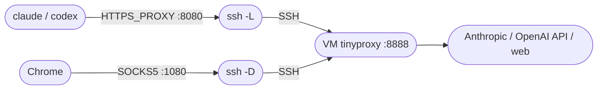

# Claude Code + Codex — Install & Proxy Guide

A copy-paste, step-by-step guide to installing **Claude Code** (Anthropic) and **Codex** (OpenAI), and running both through an SSH tunnel to a remote VM proxy.

**How traffic flows once everything is running:**



After a one-time setup you just type **`cc`** (Claude) or **`cx`** (Codex) and all of that happens automatically.

> **One tunnel, two forwards.** A single SSH connection carries both:
> - **`-L 8080 → VM:8888`** — an HTTP proxy for **Claude & Codex** ([Claude Code doesn't
>   support SOCKS proxies](https://code.claude.com/docs/en/network-config.md), so the HTTP proxy runs on the VM — set it up
>   with [`webproxy-manager`](https://github.com/crayonluffy/forge/tree/main/webproxy-manager)).
> - **`-D 1080`** — a **SOCKS5** proxy for **Chrome** / other apps (full traffic, remote DNS).

## ❓ Why a proxy (tinyproxy) on the VM?

Claude Code only speaks the **HTTP proxy protocol** — `HTTPS_PROXY=socks5://…` doesn't work. And SSH itself can't be an HTTP proxy: `-D` speaks only SOCKS, `-L` is just a dumb pipe to one destination. So an HTTP proxy must exist **somewhere**, and there are exactly two ways to do it:

| | HTTP proxy lives where? | Client runs | VM runs |
|---|---|---|---|
| **A — current** | on the VM (tinyproxy `:8888`) | plain `ssh` only | tinyproxy (one-time install) |
| **B — old** | on your laptop (`npx http-proxy-to-socks` bridge over `-D 1080`) | ssh **+ a Node bridge process** | nothing |

It's one **or** the other — with tinyproxy there is **no npx bridge anywhere**. `ssh -L 8080:127.0.0.1:8888` simply makes the VM's tinyproxy appear at `127.0.0.1:8080` on your machine, and Claude/Codex talk HTTP-proxy straight to it. This guide used design B before and [migrated to A](docs/upgrading.md) because the client-side bridge was the fragile part (orphaned node processes, `npx` startup failures on Windows). The `-D 1080` forward is kept only for `chrome-proxy` — Claude and Codex never touch it.

## 🔐 Security — how auth works

The proxy has no username/password because **your SSH key is the auth**, and nothing is exposed:

- tinyproxy binds to `127.0.0.1:8888` **on the VM** — unreachable from the internet; the only way in is an SSH-authenticated tunnel.
- your local `127.0.0.1:8080` is loopback — only processes on your own machine, only while your tunnel is up.
- tinyproxy only relays `CONNECT` traffic — TLS stays end-to-end, so the proxy can't read your API tokens or conversations.

One caveat: on a **shared** client machine, other local users could use your `127.0.0.1:8080` while the tunnel is up. For a personal laptop this is a non-issue.

---

## 🚀 Start here — follow in order

| | Page | What you'll do | Time |
|---|------|----------------|------|
| 1 | **[Install Claude Code](docs/install-claude.md)** | Node.js → `claude` CLI → sign in | ~5 min |
| 2 | **[Install Codex](docs/install-codex.md)** *(optional)* | `codex` CLI → sign in | ~3 min |
| 3 | **[Proxy setup — one command](docs/proxy-profile.md)** | Run the wizard once, get `cc` / `cx` forever | ~5 min |

Prefer nothing installed in your shell? Use **[Proxy — manual, no profile](docs/proxy-manual.md)** instead of step 3 — the same thing as plain step-by-step commands, fully written out (no collapsed sections).

---

## Daily usage (after setup)

```bash
cc              # proxy ON + launch Claude   (cc-safe keeps permission prompts)
cx              # proxy ON + launch Codex    (cx-safe keeps approval prompts)
proxy-up        # proxy ON, launch nothing
cc-stop         # proxy OFF — one off-switch for both
proxy-status    # what's running + your external IP
proxy-doctor    # something wrong? this says exactly what + how to fix
```

---

## 📚 All pages

- **Install:** [Claude Code](docs/install-claude.md) · [Codex](docs/install-codex.md)
- **Proxy:** [One-command setup (profile)](docs/proxy-profile.md) · [Manual — no profile](docs/proxy-manual.md)
- **Reference:** [🚑 Troubleshooting](docs/troubleshooting.md) · [💡 Tips & commands](docs/tips.md) · [🔄 Upgrading from the old setup](docs/upgrading.md)
