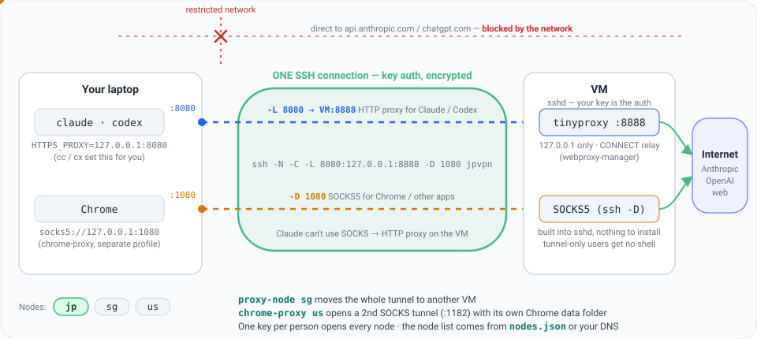

# 🔧 How it works

*Background for the curious and for admins. To just use it, see the **[Home page](https://claude-guide.vercel.app/)**.*

**How traffic flows once everything is running** (animated — packets move along the two forwards; the red one shows what happens without the tunnel):



After the one-time setup you just type **`cc`** (Claude) or **`cx`** (Codex) and all of that happens automatically.

> **One tunnel, two forwards.** A single SSH connection carries both:
> - **`-L 8080 → VM:8888`** — an HTTP proxy for **Claude & Codex** ([Claude Code doesn't
>   support SOCKS proxies](https://code.claude.com/docs/en/network-config.md), so the HTTP proxy runs on the VM — set it up
>   with [`webproxy-manager`](https://github.com/crayonluffy/forge/tree/main/webproxy-manager)).
> - **`-D 1080`** — a **SOCKS5** proxy for **Chrome** / other apps (full traffic, remote DNS).

## ❓ Why a proxy (tinyproxy) on the VM?

Claude Code only speaks the **HTTP proxy protocol** — `HTTPS_PROXY=socks5://…` doesn't work. And SSH itself can't be an HTTP proxy: `-D` speaks only SOCKS, `-L` is just a dumb pipe to one destination. So an HTTP proxy must exist **somewhere**, and there are exactly two ways to do it:

| | HTTP proxy lives where? | Client runs | VM runs |
|---|---|---|---|
| **A — current** | on the VM (tinyproxy `:8888`) | plain `ssh` only | tinyproxy (one-time install) |
| **B — old** | on your laptop (`npx http-proxy-to-socks` bridge over `-D 1080`) | ssh **+ a Node bridge process** | nothing |

It's one **or** the other — with tinyproxy there is **no npx bridge anywhere**. `ssh -L 8080:127.0.0.1:8888` simply makes the VM's tinyproxy appear at `127.0.0.1:8080` on your machine, and Claude/Codex talk HTTP-proxy straight to it. This guide used design B before and [migrated to A](upgrading.md) because the client-side bridge was the fragile part (orphaned node processes, `npx` startup failures on Windows). The `-D 1080` forward is kept only for `chrome-proxy` — Claude and Codex never touch it.

## 🔐 Security — how auth works

The proxy has no username/password because **your SSH key is the auth**, and nothing is exposed:

- tinyproxy binds to `127.0.0.1:8888` **on the VM** — unreachable from the internet; the only way in is an SSH-authenticated tunnel.
- your local `127.0.0.1:8080` is loopback — only processes on your own machine, only while your tunnel is up.
- tinyproxy only relays `CONNECT` traffic — TLS stays end-to-end, so the proxy can't read your API tokens or conversations.
- the list of VMs is fetched **privately over SSH** (`proxy-nodes --from <vm>`) — nothing about your servers is published.

One caveat: on a **shared** client machine, other local users could use your `127.0.0.1:8080` while the tunnel is up. For a personal laptop this is a non-issue.

## 🧩 What the installer sets up

| Step | What happens |
|---|---|
| SSH key | copied to `~/.ssh` and locked down (only you can read it) |
| SSH alias | `jpvpn` in `~/.ssh/config`, so `ssh jpvpn` just works |
| Profile | `cc`, `cx`, `proxy-*`, `chrome-proxy`, `cc-install` … in every new window (settings in `~/.claude-proxy.conf` / `~\.claude-proxy.conf.psd1`) |
| Node list | fetched from your VM over SSH, when your admin has set it up ([Nodes](proxy-nodes.md)) |
| Tools | `cc-install`: Node.js (LTS, via winget / the official installer on Windows, Homebrew / the official pkg on macOS, nvm / NodeSource on Linux), then Claude Code and Codex with npm — all downloaded through the proxy |

## Daily commands (full list)

```bash
cc              # proxy ON + launch Claude   (cc-safe keeps permission prompts)
cc -c           # …and continue the last session (cc -r: pick one; any claude flag passes through)
cx              # proxy ON + launch Codex    (cx-safe keeps approval prompts)
proxy-up        # proxy ON, launch nothing
cc-stop         # proxy OFF — one off-switch for both (per-node Chrome tunnels included)
proxy-status    # what's running + your external IP
proxy-doctor    # something wrong? this says exactly what + how to fix
proxy-update    # get the newest profile — your settings (proxy-config) are kept
cc-install      # check / install / update Node.js, Claude Code and Codex  (--check: report only)

proxy-nodes     # which nodes exist (jp / jp2 / sg / us …) and which one you're on
proxy-node sg   # move Claude/Codex to another node   (or: cc --node sg)
chrome-proxy us # a Chrome window through 'us' — own tunnel + profile, other nodes stay open
chrome-proxy jp --profile work   # another Chrome profile through the same node (chrome-profiles lists them)
proxy-nodes --from jpvpn         # get the node list privately from one of your VMs (over SSH)
```

Details for every command and setting: **[All commands](proxy-profile.md)**.
