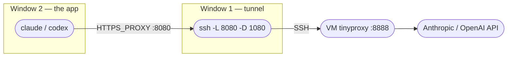

# Proxy — Manual (no profile)

Run the proxy **by hand**, with nothing installed in your shell. These are the exact steps `cc` / `cx` automate — useful when you don't want a profile, or when you're debugging one piece at a time.

**How it works — you keep 2 windows open:**



- **Window 1** holds the SSH tunnel open the whole time.
- **Window 2** gets the proxy env vars, then runs Claude or Codex.

## Before you start — checklist

- [ ] **SSH key + `jpvpn` alias installed** — if not, do [Proxy setup → Step 1](proxy-profile.md) (wizard or by-hand, either works).
- [ ] **VM proxy running** — the VM must run [`webproxy-manager`](https://github.com/crayonluffy/forge/tree/main/webproxy-manager) (tinyproxy on `127.0.0.1:8888`). Ask your admin if unsure.
- [ ] **[Claude Code](install-claude.md)** and/or **[Codex](install-codex.md)** installed.
- [ ] **Host key accepted** — run `ssh jpvpn` once, type `yes`, then exit. (First time only.)

---

## 🪟 Windows (PowerShell)

### Step 1 — Open the tunnel (Window 1 — keep it open)

```powershell
# -L 8080 -> the VM's HTTP proxy (Claude/Codex); -D 1080 -> SOCKS5 (Chrome)
ssh jpvpn -N -C -L 8080:127.0.0.1:8888 -D 1080
```

**✅ Check it worked:** the command prints nothing and just sits there. **That's correct** — `-N` means "no remote shell, just forward ports". Leave this window open. (If it exits immediately or errors, see [Didn't work?](#didnt-work) below.)

### Step 2 — Set the proxy env vars (Window 2 — a NEW window)

```powershell
$env:http_proxy="http://127.0.0.1:8080"
$env:HTTP_PROXY="http://127.0.0.1:8080"
$env:https_proxy="http://127.0.0.1:8080"
$env:HTTPS_PROXY="http://127.0.0.1:8080"
```

These only apply to **this** window — which is the point: nothing else on your machine is proxied.

### Step 3 — Verify the proxy is really carrying your traffic

```powershell
curl.exe ipinfo.io
```

**✅ Check it worked:** the `ip` shown must be the **VM's** IP, not your own. If it's your own IP, the env vars aren't set in this window — redo Step 2 in the same window.

### Step 4 — Launch Claude or Codex (same window)

```powershell
# Claude (skips permission prompts):
claude --dangerously-skip-permissions
# ...or keep prompts:  claude
```

```powershell
# Codex (skips approval prompts):
codex --dangerously-bypass-approvals-and-sandbox
# ...or keep prompts:  codex
```

### Step 5 — When you're done

- **Window 1:** press `Ctrl+C` to close the tunnel.
- **Window 2:** just close it — the env vars die with the window.

---

## 🍎 macOS / 🐧 Linux / WSL (bash or zsh)

### Step 1 — Open the tunnel (Terminal 1 — keep it open)

```bash
# -L 8080 -> the VM's HTTP proxy (Claude/Codex); -D 1080 -> SOCKS5 (Chrome)
ssh jpvpn -N -C -L 8080:127.0.0.1:8888 -D 1080
```

No `jpvpn` alias? Spell it out instead:

```bash
ssh -i ~/.ssh/<your-key> -N -C -L 8080:127.0.0.1:8888 -D 1080 <your-ssh-user>@<your-host>
```

**✅ Check it worked:** the command prints nothing and just sits there. **That's correct** — `-N` means "no remote shell, just forward ports". Leave this terminal open. (If it exits immediately or errors, see [Didn't work?](#didnt-work) below.)

### Step 2 — Set the proxy env vars (Terminal 2 — a NEW terminal)

```bash
export http_proxy=http://127.0.0.1:8080
export HTTP_PROXY=http://127.0.0.1:8080
export https_proxy=http://127.0.0.1:8080
export HTTPS_PROXY=http://127.0.0.1:8080
export NO_PROXY="localhost,127.0.0.1"   # add your corp intranet ranges here if needed
```

These only apply to **this** terminal — which is the point: nothing else on your machine is proxied.

### Step 3 — Verify the proxy is really carrying your traffic

```bash
curl ipinfo.io
```

**✅ Check it worked:** the `ip` shown must be the **VM's** IP, not your own. If it's your own IP, the env vars aren't set in this terminal — redo Step 2 in the same terminal.

### Step 4 — Launch Claude or Codex (same terminal)

```bash
# Claude (skips permission prompts):
claude --dangerously-skip-permissions
# ...or keep prompts:  claude
```

```bash
# Codex (skips approval prompts):
codex --dangerously-bypass-approvals-and-sandbox
# ...or keep prompts:  codex
```

### Step 5 — When you're done

- **Terminal 1:** press `Ctrl+C` to close the tunnel.
- **Terminal 2:** just close it — or `unset http_proxy HTTP_PROXY https_proxy HTTPS_PROXY NO_PROXY` to keep using it un-proxied.

---

## Didn't work?

| Symptom | Most likely cause → fix |
|---------|------------------------|
| Step 1 asks `Are you sure you want to continue connecting?` | Type `yes` — first connection only. If the tunnel was started in the background it can't answer; run `ssh jpvpn` once interactively first. |
| Step 1 exits immediately with `bind: Address already in use` | Something already holds port 8080/1080 (an old tunnel?). Close it, or if you have the profile installed run `cc-stop`. |
| Step 1 asks for a passphrase every time | Add the key to your agent/Keychain — see [Troubleshooting](troubleshooting.md). |
| Step 3 shows **your own** IP | Env vars not set in this window (each window needs Step 2), or the tunnel isn't up (check Window 1). |
| Step 3 hangs / times out | Tunnel is up but the VM's proxy isn't — confirm the VM runs `webproxy-manager` (tinyproxy on `:8888`). |
| Claude/Codex can't reach the API | Make sure `NO_PROXY` does **not** contain `api.anthropic.com`, and see [Troubleshooting](troubleshooting.md). |

More cases → **[Troubleshooting](troubleshooting.md)**.

> **Tip:** if you end up doing this often, the [one-command profile setup](proxy-profile.md) does all five steps as `cc` / `cx` — and `proxy-doctor` diagnoses every piece automatically.
