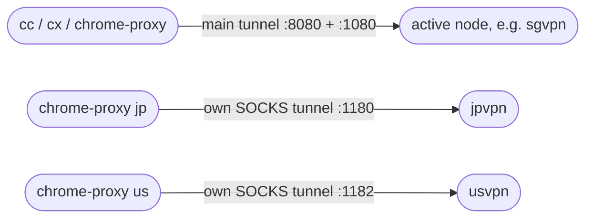

# 🌏 Nodes — switching between JP / SG / US

Since **v2.1** the profile knows about more than one VM. Your admin publishes a small **node catalogue** (`nodes.json`, next to the profile in this guide's repo); the profile downloads it, creates the matching `ssh` aliases, and gives you three things:

| You want… | Command |
|-----------|---------|
| to see which nodes exist and which one you're on | `proxy-nodes` |
| **Claude / Codex** to go out through another region | `proxy-node sg` — or just `cc --node sg` / `cx --node sg` |
| a **Chrome window** through a specific region — *without* touching what `cc` uses, and with several regions open at once | `chrome-proxy sg` |

Nothing changes for people who only use one node: `cc`, `cx` and `chrome-proxy` keep working exactly as before.

> **Profile older than 2.1?** `proxy-update` (settings kept), then `proxy-nodes --refresh` (`-Refresh` on Windows) once. The setup wizard also installs the catalogue when it (re)installs the profile.

---

## How it works



- A **node** is just an `~/.ssh/config` alias (`jpvpn`, `sgvpn`, `usvpn`, …) — the same kind the setup wizard created for your first server. All of them reuse the **same SSH key**; `proxy-nodes --refresh` copies the `IdentityFile` from your existing alias when it writes the new ones.
- The **active node** is the one `cc` / `cx` (and a plain `chrome-proxy`) use. It's simply `SSH_HOST` in your settings file — `proxy-node <name>` changes it and, if the tunnel is up, restarts it on the new node.
- `chrome-proxy <name>` for a node that is **not** active starts a **second, SOCKS-only tunnel** to that node on its own port (`NODE_SOCKS_BASE` + the node's position in the catalogue: `1180`, `1181`, `1182`, …) and opens Chrome with a **profile folder of its own** (`…-jp`, `…-sg`, …). That's what lets a JP window and an SG window run side by side — Chrome ignores a different `--proxy-server` for a profile folder that is already open, so one folder per node is a must, and it also keeps each region's logins/cookies apart.
- `cc-stop` stops everything: the main tunnel **and** every per-node Chrome tunnel. `proxy-status` shows them all.

---

## Commands

```bash
proxy-nodes                 # list: * marks the active node, plus which tunnels are up
proxy-nodes --refresh       # re-download the catalogue + create any missing ssh aliases   (Windows: -Refresh)

proxy-node                  # show the active node
proxy-node sg               # switch Claude/Codex to sg (saved in your settings; restarts the tunnel if it's running)
cc --node sg                # same as 'proxy-node sg' followed by 'cc'   (also cx --node sg, proxy-up --node sg)

chrome-proxy                # Chrome through the ACTIVE node (main tunnel, started if needed)
chrome-proxy jp             # Chrome through jp on its own tunnel + profile (main tunnel untouched)
chrome-proxy us https://x   # ...and open a URL there (any non-node argument goes to Chrome)
```

`proxy-nodes` output looks like this:

```
=== Proxy nodes (catalogue: ~/.claude-proxy.nodes.json, updated 2026-09-15) ===

    jp   jpvpn    Japan       ubuntu@203.0.113.10       Chrome tunnel UP (:1180)
  * sg   sgvpn    Singapore   ubuntu@sg.proxy.example   ACTIVE - cc/cx tunnel UP (127.0.0.1:8080 / :1080)
    us   usvpn    US          <not provisioned>
```

`<not provisioned>` means the admin listed the node but hasn't filled in its address yet — you can't switch to it until they do.

**Switching nodes while Claude is running:** `proxy-node` restarts the tunnel underneath the *same* local port, so a running `claude` just sees a brief reconnect. Other terminals keep the old node until they reload the profile (`source ~/.claude-proxy.sh`, or a new window).

---

## Settings involved

| macOS / Linux key | Windows key | Default | Meaning |
|---|---|---|---|
| `CLAUDE_SSH_HOST` | `SSH_HOST` | `jpvpn` | the active node's alias — what `proxy-node` changes |
| `CLAUDE_NODE_SOCKS_BASE` | `NODE_SOCKS_BASE` | `1180` | first port for per-node Chrome tunnels (node *i* uses base + *i*). Change it if something else lives on `1180`–`1189` |
| `CLAUDE_CHROME_BIN` | `CHROME_EXE` | *(auto)* | only if Chrome isn't in the usual place (Windows also checks `%LOCALAPPDATA%`) |
| `CLAUDE_PROXY_NODES` *(env only)* | — | `~/.claude-proxy.nodes.json` | where the downloaded catalogue is cached |

Chrome profile folders: `~/.chrome-proxy-profile-<node>` (macOS), `~/.config/google-chrome-vpn-<node>` (Linux), `C:\ChromeVPNProfile-<node>` (Windows), `C:\wsl-proxy-profile-<node>` (WSL). The first time you run `chrome-proxy` after upgrading, the old single folder is renamed to the active node's folder, so your existing logins survive.

---

## No profile? The manual equivalent

One extra `ssh` per region, SOCKS only, each on its own port — then Chrome with a *different* `--user-data-dir` per region:

```bash
ssh sgvpn -N -C -D 1181        # terminal A (keep open)
ssh usvpn -N -C -D 1182        # terminal B (keep open)

# macOS - one Chrome per region, each with its own profile folder
open -n -a "Google Chrome" --args --proxy-server="socks5://127.0.0.1:1181" \
    --host-resolver-rules="MAP * ~NOTFOUND , EXCLUDE 127.0.0.1" --user-data-dir="$HOME/.chrome-proxy-profile-sg" --no-first-run
open -n -a "Google Chrome" --args --proxy-server="socks5://127.0.0.1:1182" \
    --host-resolver-rules="MAP * ~NOTFOUND , EXCLUDE 127.0.0.1" --user-data-dir="$HOME/.chrome-proxy-profile-us" --no-first-run
```

To move **Claude/Codex** to another region without the profile, just open the [manual Step-1 tunnel](proxy-manual.md) against the other alias (`ssh sgvpn -N -C -L 8080:127.0.0.1:8888 -D 1080`) — the env vars in Step 2 stay the same.

---

## 🛠 For admins — publishing nodes

The catalogue is [`scripts/nodes.json`](https://github.com/crayonluffy/claude-guide/blob/main/scripts/nodes.json) in this repo (served at `https://claude-guide.vercel.app/scripts/nodes.json` and via the GitHub raw URL the profile already uses for `proxy-update`). One line per node:

```json
{ "name": "sg", "alias": "sgvpn", "host": "sg.proxy.example.com", "user": "ubuntu", "ssh_port": 22, "proxy_port": 8888, "region": "Singapore", "note": "", "hostkey": "ssh-ed25519 AAAA..." }
```

| Field | Meaning |
|-------|---------|
| `name` | short id users type: `proxy-node sg` |
| `alias` | the `~/.ssh/config` alias the profile creates (`sgvpn`) — keep the existing `jpvpn` for the first node so nobody's config changes |
| `host` | IP **or DNS name**. A DNS name (e.g. a Cloudflare `A` record `sg.proxy.yourdomain`) lets you move the VM later without every user re-running anything. Leave the `<placeholder>` until the VM exists — users then see *not provisioned* |
| `user`, `ssh_port` | SSH login for that VM |
| `proxy_port` | tinyproxy port on that VM (`webproxy-manager` default `8888`) |
| `hostkey` | optional but recommended: `ssh-keyscan -t ed25519 <host> \| cut -d' ' -f2-`. The profile pins it in `known_hosts`, so the first connection never stops at *"Are you sure you want to continue connecting?"* |

Rules that matter:

- **Append new nodes at the end and never reorder** — a node's position is its Chrome-tunnel port on every client.
- **Keep one node object per line** — the shell profile has a `jq`-free fallback parser that relies on it.
- Every VM needs [`webproxy-manager`](https://github.com/crayonluffy/forge/tree/main/webproxy-manager) (tinyproxy) and the users' public keys, exactly like the first one.
- Push to `main`; clients pick it up on their next `proxy-nodes --refresh` (or wizard run). Existing aliases are never overwritten — if a node's address changes, users edit `~/.ssh/config` (or delete that `Host` block and refresh).
